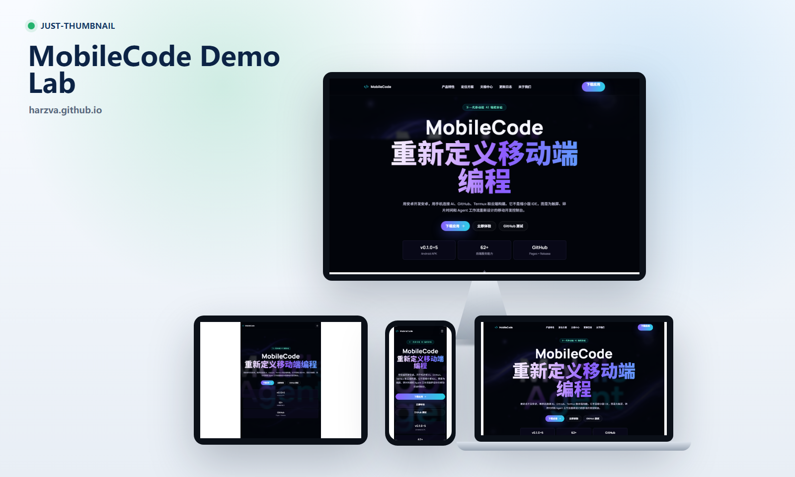
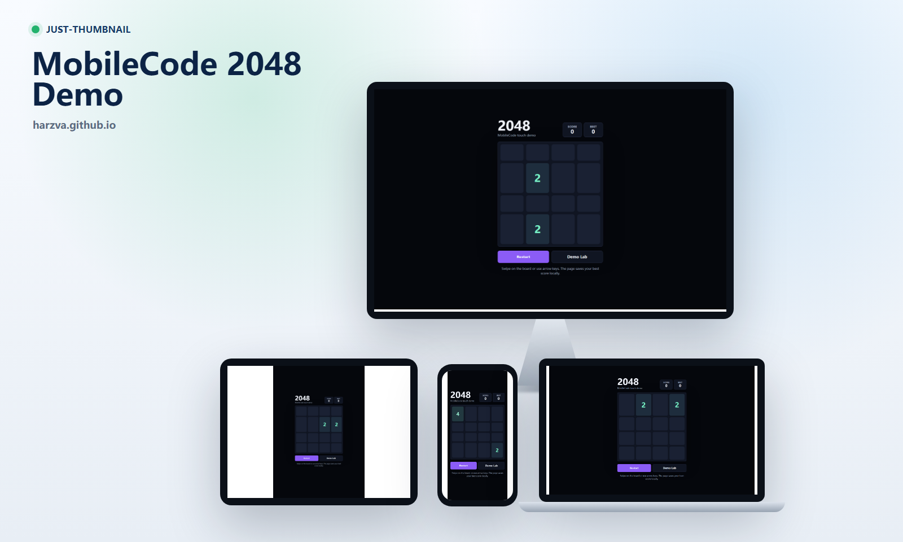
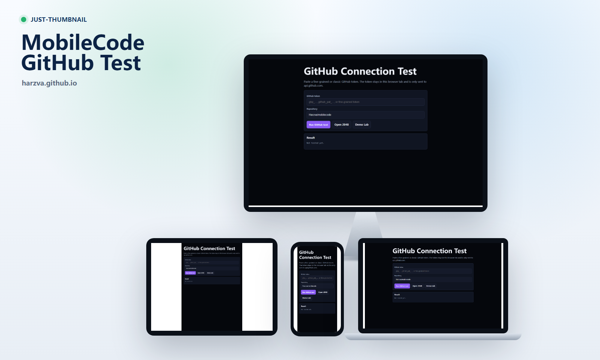
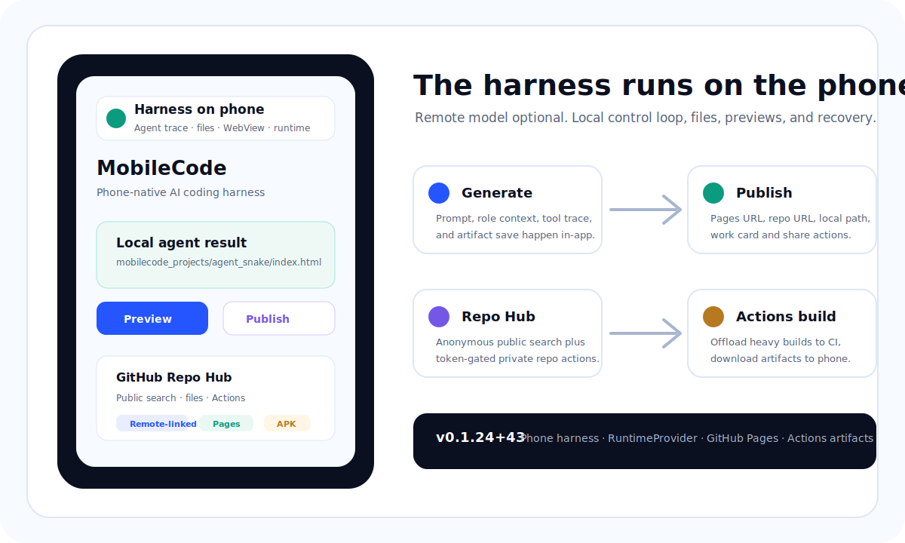
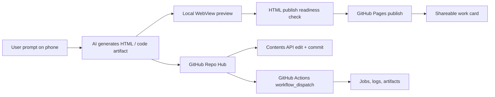
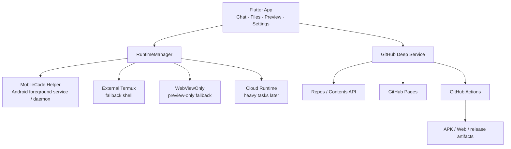

# MobileCode

<p align="center">
  <strong>Mobile-first AI Coding Workspace</strong>
  <br />
  在手机上生成、编辑、预览、发布网页，并把 GitHub 作为轻量远端工作区、Pages 发布层和 Actions 构建层。
</p>

<p align="center">
  <a href="https://github.com/Harzva/mobilecode/actions/workflows/mobile-runtime-ci.yml"></a>
  <a href="https://github.com/Harzva/mobilecode/actions/workflows/android-apk.yml"></a>
  <a href="https://github.com/Harzva/mobilecode/actions/workflows/android-app-test.yml"></a>
  
  
</p>

<p align="center">
  <a href="https://harzva.github.io/mobilecode/">Demo Lab</a>
  ·
  <a href="https://harzva.github.io/mobilecode/demo/2048/">2048 Demo</a>
  ·
  <a href="https://harzva.github.io/mobilecode/github-test/">GitHub Test</a>
  ·
  <a href="https://github.com/Harzva/mobilecode/releases">Download APK</a>
  ·
  <a href="docs/mobilecode-release-qa.md">Release QA</a>
</p>

<p align="center">
  <a href="https://harzva.github.io/mobilecode/">
    
  </a>
</p>

## Why MobileCode

MobileCode 的第一性原理很简单：手机端不适合塞一个完整桌面编译环境，但非常适合成为 AI coding 的控制台。

它把最重的部分交给外部平台，把最贴近用户的部分留在手机上：

| Layer | MobileCode does | External layer does |
| --- | --- | --- |
| Product UI | Chat, file cards, preview, runtime diagnostics, settings | None |
| Local runtime | Helper / Termux / WebViewOnly through `RuntimeProvider` | Shell, logs, small local tasks |
| GitHub-first workspace | Repo Hub, watchlist, remote-linked folders, Pages publish cards | Repos, Contents API commits, Actions builds, artifacts |
| Web artifacts | Generate HTML, run publish readiness checks, open browser/WebView | GitHub Pages hosting |
| Heavy builds | Show workflow status, jobs, artifacts | GitHub Actions APK/Web/release builds |

## Effect Showcase

These thumbnails are generated from the live GitHub Pages demos with `just-thumbnail`, so the README shows rendered pages rather than mock claims.

<table>
  <tr>
    <td width="33%">
      <a href="https://harzva.github.io/mobilecode/">
        
      </a>
      <br>
      <strong>Demo Lab</strong>
      <br>
      Product landing and demo index published on GitHub Pages.
    </td>
    <td width="33%">
      <a href="https://harzva.github.io/mobilecode/demo/2048/">
        
      </a>
      <br>
      <strong>2048 Web</strong>
      <br>
      Touch-first generated HTML game for mobile WebView checks.
    </td>
    <td width="33%">
      <a href="https://harzva.github.io/mobilecode/github-test/">
        
      </a>
      <br>
      <strong>GitHub Test</strong>
      <br>
      Browser-side token and repo access verification page.
    </td>
  </tr>
</table>

| Scene | What to try | Link |
| --- | --- | --- |
| Demo Lab | A static landing page for published mobile demos | [Open demo lab](https://harzva.github.io/mobilecode/) |
| 2048 Web | Touch-first generated HTML game, useful for WebView and mobile layout checks | [Play 2048](https://harzva.github.io/mobilecode/demo/2048/) |
| GitHub Test | Verify token identity, repo access, and Pages readiness from a browser | [Open GitHub test](https://harzva.github.io/mobilecode/github-test/) |
| Repo Hub | Watch repos, map them to `mobilecode_projects/github/<owner>/<repo>/`, inspect Actions, edit files through GitHub API | `mobile_agent/lib/screens/github_repo_hub_screen.dart` |
| Published Work Card | After Pages publish, show Pages URL, repo URL, local file path, browser open, copy/share, and redeploy actions | `mobile_agent/lib/screens/home_screen.dart` |

<p align="center">
  
</p>

## Product Loop



## Current Capabilities

- Runtime abstraction: `RuntimeProvider`, `RuntimeManager`, Helper, External Termux, planned Embedded Lite, Cloud, and WebViewOnly fallback.
- MobileCode Helper prototype: health, execute, streaming logs, task stop, task state, preflight checks.
- Chat and agent process UI: model call progress, stop control, trace cards, generated artifact cards.
- HTML-first generation: built-in HTML/UI skill context, publish readiness checks, WebView preview, browser open, GitHub Pages publish.
- GitHub-first workspace: repo list, watchlist, language/Pages/local filters, local existence status, Remote-linked folder marker.
- GitHub Actions surface: workflows, latest run status, jobs/steps, workflow dispatch, artifact zip download record.
- API-backed file flow: browse remote tree, read text files, edit, commit via GitHub Contents API, reload on SHA conflict.
- Extension management: Roles, Skill, MCP, Memory, Agent, Hook Registry surfaces for role-based workflows.
- Observability: RR AgentView, pending role approvals, Token Usage/cache-hit statistics, searchable/sortable LiteLLM-style pricing with manual snapshot checks, and Device Telemetry htop-style phone health.
- Lark CLI connector: opt-in diagnostics and structured dry-run action model.

## Architecture



## Quick Start

### Try the published demos

Open:

- [Demo Lab](https://harzva.github.io/mobilecode/)
- [2048 Web Demo](https://harzva.github.io/mobilecode/demo/2048/)
- [GitHub Test](https://harzva.github.io/mobilecode/github-test/)

### Build the product site

```bash
cd app
npm install
npm run build
```

### Build the Flutter app

Local Flutter SDK is required:

```bash
cd mobile_agent
flutter pub get
flutter create --platforms=android,ios .
flutter build apk --release
```

For release QA, prefer GitHub Actions so the build is reproducible:

- [Mobile Runtime CI](https://github.com/Harzva/mobilecode/actions/workflows/mobile-runtime-ci.yml)
- [Build Android APK](https://github.com/Harzva/mobilecode/actions/workflows/android-apk.yml)
- [Android App Smoke Test](https://github.com/Harzva/mobilecode/actions/workflows/android-app-test.yml)

## Runtime Strategy

MobileCode does not try to become a full Termux clone. The long-term model is:

```text
Flutter App
  -> RuntimeProvider abstraction
  -> MobileCode Helper
  -> External Termux fallback
  -> Embedded Lite runtime later
  -> Cloud runtime for heavy builds
  -> GitHub Pages + GitHub Actions for shipping
```

That keeps the phone lightweight while still letting users produce shareable web pages, inspect repos, commit small changes, and build APKs through GitHub Actions.

## Repository Structure

```text
.
├─ app/                     React/Vite product site
├─ docs/                    GitHub Pages demos, QA docs, runtime docs
├─ mobile_agent/            Flutter app source
│  ├─ lib/screens/          Home, GitHub Repo Hub, Skill/MCP/Agent/Memory UI
│  ├─ lib/services/         Runtime, GitHub, Pages, Helper, skill services
│  └─ assets/               Role avatars and icons
├─ mobile-coding-*.md       Product and architecture analysis
└─ README.md                Project homepage
```

## Release Line

Current candidate: `0.1.23+42`.

See:

- [Version Policy](docs/mobilecode-version-policy.md)
- [Release QA Checklist](docs/mobilecode-release-qa.md)
- [Helper Runtime Protocol](docs/mobilecode-helper-runtime-protocol.md)
- [Production Hardening Notes](docs/mobilecode-production-hardening.md)

## Roadmap

| Priority | Next focus | Stop condition |
| --- | --- | --- |
| P0 | Pass Mobile Runtime CI, Android APK build, Android smoke test for the pushed commit | APK artifact is downloadable and app launches |
| P1 | Smooth Repo Hub file edit conflict handling and artifact download UX | User can recover from SHA conflicts and find downloaded artifacts |
| P2 | Expand API-backed workspace into selected repo file import/export | Phone can edit selected repo files without true clone |
| Later | Helper APK maturity, queue recovery, PTY, cloud heavy builds | Runtime remains replaceable behind `RuntimeProvider` |

## Status

This repository is actively moving toward a deployable mobile coding workspace. The Android build path is GitHub Actions-first; local machines without Flutter/Android SDK should use CI artifacts instead of local builds.

## License

No license file is included yet. Add a `LICENSE` before treating this as a reusable open-source distribution.
