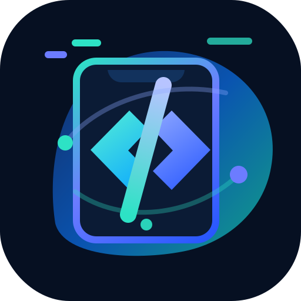
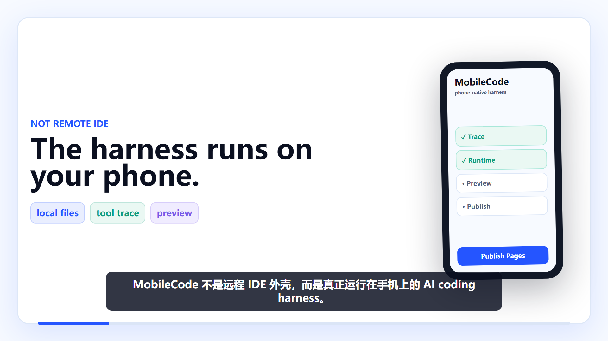
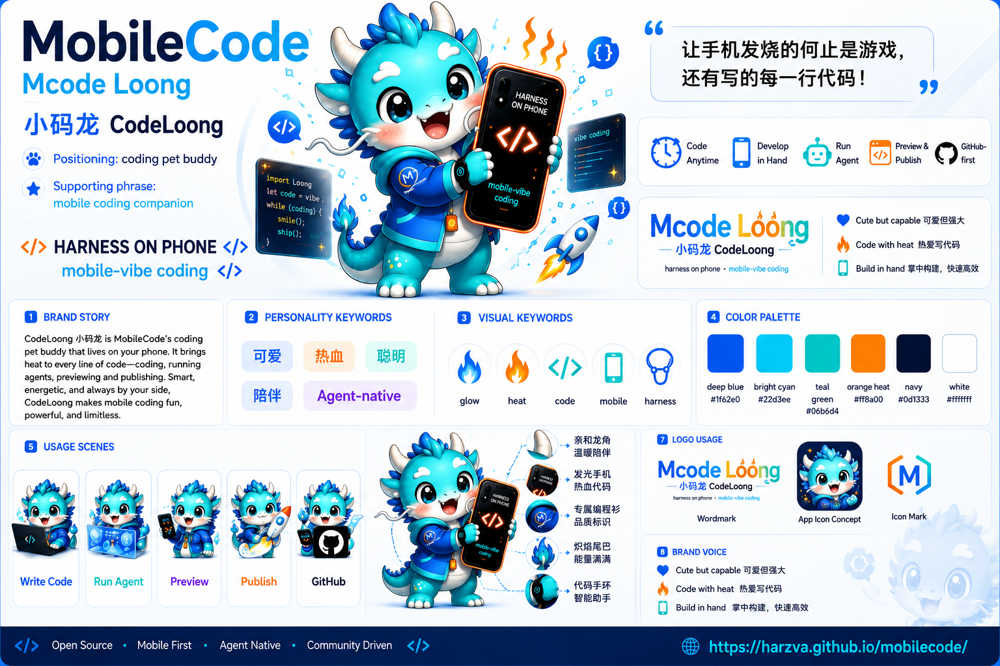
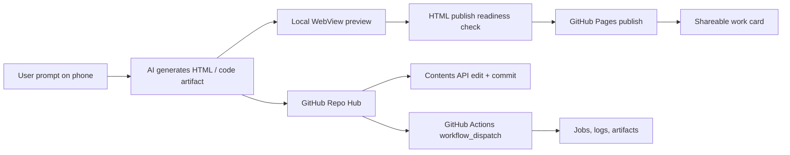
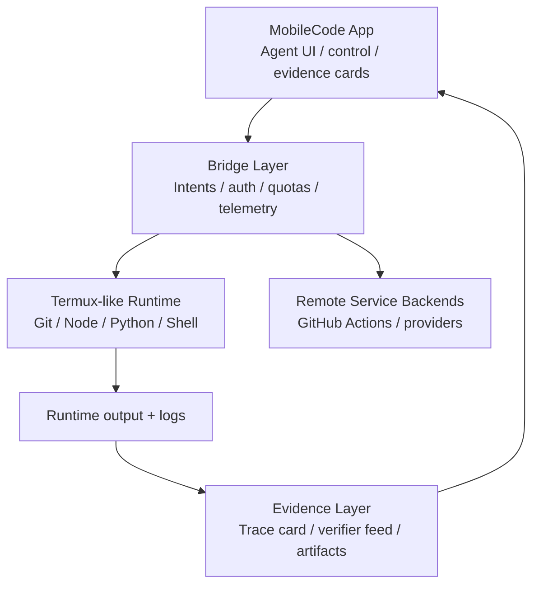
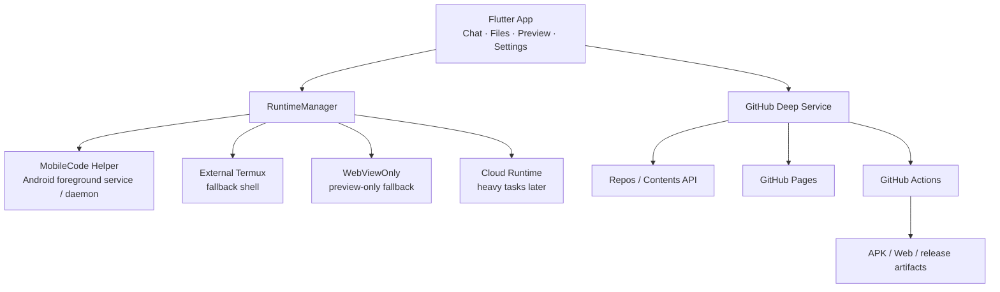

# MobileCode

<p align="center">
  
  <br />
  <strong>Phone-native AI Coding Harness</strong>
  <br />
  The agent harness runs on the phone. Models can be remote; the coding loop, files, previews, runtime routing, and shipping controls stay in MobileCode.
  <br />
  不是远程 IDE 的手机壳，而是真正把 agent loop、工具状态、文件、预览和发布控制面放到手机本机的 MobileCode。
</p>

<p align="center">
  <a href="https://github.com/Harzva/mobilecode/actions/workflows/mobile-runtime-ci.yml"></a>
  <a href="https://github.com/Harzva/mobilecode/actions/workflows/mobile-app-release.yml"></a>
  <a href="https://github.com/Harzva/mobilecode/actions/workflows/android-apk.yml"></a>
  <a href="https://github.com/Harzva/mobilecode/actions/workflows/android-app-test.yml"></a>
  
  
</p>

<p align="center">
  <a href="docs/assets/mobilecode-short-teaser.mp4"><strong>Watch 15s Short</strong></a>
  ·
  <a href="docs/assets/mobilecode-promo-vertical.mp4"><strong>Watch 9:16 Promo Video</strong></a>
  ·
  <a href="docs/assets/mobilecode-readme-cover.mp4">README Motion Cover</a>
  ·
  <a href="https://harzva.github.io/mobilecode/mobilecode-principle-video.html">HTML Principle Video</a>
  ·
  <a href="https://github.com/Harzva/mobilecode/releases/tag/v0.1.68-mobile-harness-d2dd9a7">Download v0.1.68 apps</a>
  ·
  <a href="https://harzva.github.io/mobilecode/">GitHub Pages Demo</a>
</p>

<p align="center">
  <a href="https://harzva.github.io/mobilecode/">Demo Lab</a>
  ·
  <a href="https://harzva.github.io/mobilecode/demo/2048/">2048 Demo</a>
  ·
  <a href="https://harzva.github.io/mobilecode/github-test/">GitHub Test</a>
  ·
  <a href="https://github.com/Harzva/mobilecode/actions/runs/27287231941">Dual app build</a>
  ·
  <a href="https://github.com/Harzva/mobilecode/releases">Download app builds</a>
  ·
  <a href="docs/mobilecode-release-qa.md">Release QA</a>
</p>

<p align="center">
  <a href="https://harzva.github.io/mobilecode/">
    
  </a>
</p>

<p align="center">
  <a href="https://harzva.github.io/mobilecode/mobilecode-principle-video.html">
    
  </a>
  <br>
  <sub>15-second Remotion teaser with voiceover. Full explainer covers demand, pain, RuntimeProvider, and GitHub-first shipping.</sub>
</p>

## Product Preview

MobileCode is packaged as a phone-native coding harness: a small mobile companion for writing, previewing, running agent tasks, and shipping artifacts from the same handheld workspace.

<p align="center">
  
</p>

<p align="center">
  <video src="app/public/showcase/mobilecode-product-walkthrough.mp4" width="360" controls muted playsinline>
    <a href="app/public/showcase/mobilecode-product-walkthrough.mp4">Watch MobileCode product walkthrough MP4</a>
  </video>
  <br>
  <sub>If your Markdown viewer does not embed video, open <a href="app/public/showcase/mobilecode-product-walkthrough.mp4">mobilecode-product-walkthrough.mp4</a>.</sub>
</p>

| Runs on the phone | Remote by choice | GitHub-first shipping |
| --- | --- | --- |
| Agent trace, tool selection, runtime routing, local files, WebView preview, result cards | Model provider, optional Cloud Runtime, external Termux/Helper backends | Repo discovery, Contents API commits, Pages publish, Actions builds, release artifacts |

## Why MobileCode

MobileCode 的第一性原理很简单：手机端不适合塞一个完整桌面编译环境，但非常适合成为 AI coding 的本机 harness。

它不是 Codex Remote、Claude Remote 或云端 IDE 的移动端外壳。模型可以来自云端 provider，但对话、工具编排、运行时选择、文件落盘、WebView 预览、GitHub 发布和恢复提示都在手机 App 内闭环。

它把最重的部分交给外部平台，把最贴近用户的部分留在手机上：

| Layer | MobileCode does | External layer does |
| --- | --- | --- |
| Phone-native harness | Chat, tool trace, role cards, file cards, preview, runtime diagnostics, settings | None |
| Local runtime | Helper / Termux / WebViewOnly through `RuntimeProvider` | Shell, logs, small local tasks |
| GitHub-first workspace | Repo Hub, watchlist, remote-linked folders, Pages publish cards | Repos, Contents API commits, Actions builds, artifacts |
| Web artifacts | Generate HTML, run publish readiness checks, open browser/WebView | GitHub Pages hosting |
| Heavy builds | Show workflow status, jobs, artifacts | GitHub Actions APK/Web/release builds |

## Research Signal: Mobile Harness Era

PhoneWorld 的最新研究把 phone-use agent 的瓶颈从“模型是否会点手机”推进到“谁能规模化提供可控环境、任务、验证器、轨迹和训练/评测 harness”。这不是对 MobileCode 的直接背书，但它清晰说明了一个方向：手机 Agent 的下一阶段核心资产是可执行、可复现、可验证的 harness。

MobileCode 选择从 AI coding 切入同一条趋势：模型可以远程，重构建可以交给 GitHub Actions，但会话、工具轨迹、文件、HTML/Markdown 预览、运行时路由、GitHub 发布、构建 artifact 和结果证据需要在手机端形成闭环。

- Paper: [PhoneWorld: Scaling Phone-Use Agent Environments](https://arxiv.org/abs/2605.29486)
- Local PDF: [docs/research/phoneworld-scaling-phone-use-agent-environments-2605.29486.pdf](docs/research/phoneworld-scaling-phone-use-agent-environments-2605.29486.pdf)
- MobileCode analysis: [PhoneWorld 与 Mobile Harness 时代](docs/mobile-harness/phoneworld-mobile-harness-era.md)
- MobileCode product roadmp: [MobileCode 长期路线图](docs/mobilecode-long-term-roadmap.md)
- Long-term roadmp: [Mobile Harness 长期路线图](docs/mobile-harness-roadmp/roadmp-mobile-harness.md)
- ICLR draft: [PDF](paper/iclr-mobile-harness/main.pdf) · [TeX](paper/iclr-mobile-harness/main.tex)
- Anonymous supplement boundary: [include/exclude and redaction gate](paper/iclr-mobile-harness/SUPPLEMENT_BOUNDARY.md)
- Current anonymous supplement: `paper/iclr-mobile-harness/build/mobile-harness-anonymous-supplement.zip` (staged file count and byte size are emitted by the supplement script)
- Benchmark seed: [MobileHarnessBench](docs/mobile-harness-benchmark/README.md)
- v1 task bank: [200 MobileHarnessBench candidate tasks](docs/mobile-harness-benchmark/tasks/v1-task-bank.json)
- v2 task bank: [1000 MobileHarnessBench candidate tasks](docs/mobile-harness-benchmark/tasks/v2-task-bank.json)
- v2 quality audit: [machine audit report](docs/mobile-harness-benchmark/reports/v2-quality-audit.md)
- Verifier contracts: [machine-readable catalog](docs/mobile-harness-benchmark/verifiers/verifier-contracts.json) · [coverage readiness](docs/mobile-harness-benchmark/reports/verifier-contract-readiness.md)
- Baseline protocol: [comparison readiness](docs/mobile-harness-benchmark/reports/baseline-protocol-readiness.md)
- Baseline run contract: [result schema readiness](docs/mobile-harness-benchmark/reports/baseline-run-contract.md)
- Baseline scaffold: [not-run scaffold manifest](docs/mobile-harness-benchmark/baselines/2026-06-06-baseline-scaffold/README.md)
- Baseline T0 dry run: [not-counted dry-run manifest](docs/mobile-harness-benchmark/baselines/2026-06-06-baseline-dry-run-t0/README.md)
- Baseline pilot pack: [prompt and evidence templates](docs/mobile-harness-benchmark/baselines/2026-06-06-baseline-pilot-pack/README.md)
- Baseline pilot readiness: [non-counted readiness gate](docs/mobile-harness-benchmark/reports/baseline-pilot-readiness.md)
- Core claim readiness: [positioning claim boundary](docs/mobile-harness-benchmark/reports/core-claim-readiness.md)
- Evidence maturity: [claim maturity matrix](docs/mobile-harness-benchmark/reports/evidence-maturity-matrix.md)
- Evaluation protocol readiness: [E1-E5 machine-checkable protocol](docs/mobile-harness-benchmark/reports/evaluation-protocol-readiness.md)
- Method presentation readiness: [visuals, algorithms, modules and formulas gate](docs/mobile-harness-benchmark/reports/method-presentation-readiness.md)
- Bibliography readiness: [verified related-work metadata](docs/mobile-harness-benchmark/reports/bibliography-readiness.md)
- Threats to validity: [review risk matrix](docs/mobile-harness-benchmark/reports/threats-to-validity.md)
- Page-limit readiness: [compiled PDF page boundary](docs/mobile-harness-benchmark/reports/page-limit-readiness.md)
- Reproducibility checklist: [command-to-artifact matrix](docs/mobile-harness-benchmark/reports/reproducibility-checklist.md)
- Submission readiness: [draft upload gate](docs/mobile-harness-benchmark/reports/submission-readiness.md)
- Paper claim ledger: [claim-to-evidence map](docs/mobile-harness-benchmark/reports/paper-claim-evidence-ledger.md)
- Mobile-tier readiness: [Android/iOS readiness probe](docs/mobile-harness-benchmark/reports/mobile-tier-readiness.md)
- Mobile evidence pack: [T2/T3 capture templates](docs/mobile-harness-benchmark/reports/mobile-evidence-pack-readiness.md) · [execution playbook](docs/mobile-harness-benchmark/mobile-evidence/2026-06-06-mobile-evidence-pack/execution-playbook.md)
- Draft frozen subset: [planning manifest](docs/mobile-harness-benchmark/tasks/frozen-v2-paper-subset.json) · [readiness report](docs/mobile-harness-benchmark/reports/frozen-subset-readiness.md)
- Mobile test strategy: [Android/iOS benchmark tiers](docs/mobile-harness-benchmark/mobile-test-strategy.md)
- Simulator launcher reference: [simutil](https://github.com/dungngminh/simutil)
- MobileCode Skill Spec: [SKILL.md + WebView script + permission + verifier contract](docs/mobile-harness-benchmark/skill-spec.md)
- Harness Task Registry: [task metadata for Tools, sheets, routes, skills and benchmark evidence](docs/mobile-harness-benchmark/harness-task-registry.md)
- v0 dry run evidence: [2026-06-06 representative run](docs/mobile-harness-benchmark/runs/2026-06-06-v0-dry-run/summary.md)
- smoke-v2 T0 evidence: [2026-06-06 60-task smoke run](docs/mobile-harness-benchmark/runs/2026-06-06-smoke-v2-t0/summary.md)

## Inspired by On-device AI Gallery Patterns

Recent on-device AI applications are moving from plain chat demos toward task galleries, skill packages, tool bridges, model/runtime management and benchmark views. Google AI Edge Gallery is a useful public example of this product shape: it organizes on-device models around tasks, custom tasks, skills, MCP tooling and benchmark surfaces. MobileCode adopts the pattern but changes the object of evaluation. Instead of becoming a general model gallery, MobileCode turns phone-native AI coding into a harness: incoming files, artifact editing, HTML/Markdown preview, GitHub delivery, runtime routing, verifier contracts and evidence reports.

The practical design consequence is now explicit in the repo:

- Skills use `SKILL.md`, `scripts/index.html`, permission tokens and verifier contracts.
- Tools, sheets and pages are promoted into a Harness Task Registry instead of remaining one-off buttons.
- Benchmark Lab is becoming an in-app surface for MobileHarnessBench status, task tiers and evidence boundaries.
- Claims remain evidence-bound: T0 fixture runs, mobile tiers, GitHub sandbox delivery and baseline comparison are reported separately.

## Effect Showcase

These thumbnails are generated from the live GitHub Pages demos with `just-thumbnail`, so the README shows rendered pages rather than mock claims.

<table>
  <tr>
    <td width="33%">
      <a href="https://harzva.github.io/mobilecode/">
        
      </a>
      <br>
      <strong>Demo Lab</strong>
      <br>
      Product landing and demo index published on GitHub Pages.
    </td>
    <td width="33%">
      <a href="https://harzva.github.io/mobilecode/demo/2048/">
        
      </a>
      <br>
      <strong>2048 Web</strong>
      <br>
      Touch-first generated HTML game for mobile WebView checks.
    </td>
    <td width="33%">
      <a href="https://harzva.github.io/mobilecode/github-test/">
        
      </a>
      <br>
      <strong>GitHub Test</strong>
      <br>
      Browser-side token and repo access verification page.
    </td>
  </tr>
</table>

| Scene | What to try | Link |
| --- | --- | --- |
| Demo Lab | A static landing page for published mobile demos | [Open demo lab](https://harzva.github.io/mobilecode/) |
| 2048 Web | Touch-first generated HTML game, useful for WebView and mobile layout checks | [Play 2048](https://harzva.github.io/mobilecode/demo/2048/) |
| GitHub Test | Verify token identity, repo access, and Pages readiness from a browser | [Open GitHub test](https://harzva.github.io/mobilecode/github-test/) |
| Repo Hub | Watch repos, map them to `mobilecode_projects/github/<owner>/<repo>/`, inspect Actions, edit files through GitHub API | `mobile_agent/lib/screens/github_repo_hub_screen.dart` |
| Published Work Card | After Pages publish, show Pages URL, repo URL, local file path, browser open, copy/share, and redeploy actions | `mobile_agent/lib/screens/home_screen.dart` |

## Product Loop



## Current Capabilities

- Runtime abstraction: `RuntimeProvider`, `RuntimeManager`, Helper, External Termux, planned Embedded Lite, Cloud, and WebViewOnly fallback.
- MobileCode Helper prototype: health, execute, streaming logs, task stop, task state, preflight checks.
- Chat and agent process UI: model call progress, stop control, trace cards, generated artifact cards.
- HTML-first generation: built-in HTML/UI skill context, publish readiness checks, WebView preview, browser open, GitHub Pages publish.
- GitHub-first workspace: repo list, watchlist, language/Pages/local filters, local existence status, Remote-linked folder marker.
- [Safe container architecture](docs/mobilecode-container-architecture.md): multi-workspace, multi-runtime, multi-preview, and evidence-ledger model for phone-native AI coding.
- GitHub Actions surface: workflows, latest run status, jobs/steps, workflow dispatch, artifact zip download record.
- API-backed file flow: browse remote tree, read text files, edit, commit via GitHub Contents API, reload on SHA conflict.
- Extension management: Roles, Skill, MCP, Memory, Agent, Hook Registry surfaces for role-based workflows.
- Observability: RR AgentView, pending role approvals, Token Usage/cache-hit statistics, searchable/sortable LiteLLM-style pricing with manual snapshot checks, and Device Telemetry htop-style phone health.
- [Lark Native API plan](docs/lark-native-api-upgrade-plan.md): agent-facing, Node-free Lark OpenAPI tools for Docs, Drive, Sheets, Bitable, Wiki, and evidence publishing; official CLI/MCP remain Mac/CI development probes, not embedded app runtimes.

## Long-term Termux-like Runtime Plan

MobileCode is the phone-native layer for agent control, artifact review, and release evidence.
The long-term runtime direction is a **Termux-like substrate** (git + node + python + shell) that is invoked by the app as a service, while the user stays in MobileCode's control surface.

It should **not** be an embedded Termux terminal UI, and it should not become a generic remote IDE shell. The phone is still the command center: chat, role controls, route selection, previews, and shipping actions remain first-class inside MobileCode.

- Layer 1 - **MobileCode App**: conversations, tool cards, prompt state, repo selection, publish checks, and evidence surfaces.
- Layer 2 - **Termux-like Runtime**: long-term execution substrate for commands and project-level tooling, with isolation, caching, and runtime profiles.
- Layer 3 - **Bridge Layer**: typed runtime API, auth/session binding, intent routing, quota + timeout policy, and cancellation semantics.
- Layer 4 - **Evidence Layer**: command traces, logs, verifier signals, publish artifacts, and reproducibility records.



Current repo implementation has runtime abstractions and helper paths in place; the full Termux-like embedded substrate is a roadmap objective, not a completed production feature yet.

## Architecture



## Quick Start

### Try the published demos

Open:

- [Demo Lab](https://harzva.github.io/mobilecode/)
- [2048 Web Demo](https://harzva.github.io/mobilecode/demo/2048/)
- [GitHub Test](https://harzva.github.io/mobilecode/github-test/)

### Build the product site

```bash
cd app
npm install
npm run build
```

### Delegate bounded development tasks

Non-multimodal small tasks should default to `cxspark`: README/docs drafts, narrow code patches, checklists, prompt edits, and mechanical changes. The parent Codex session still owns planning, review, verification, commits, releases, visual/device QA, and any risky operation. See [cxspark Agent Workflow](docs/cxspark-agent-workflow.md).

### Build the Flutter app

Local Flutter SDK is required:

```bash
cd mobile_agent
flutter pub get
flutter create --platforms=android,ios .
flutter build apk --release
```

For release QA, prefer GitHub Actions so the build is reproducible:

- [Mobile Runtime CI](https://github.com/Harzva/mobilecode/actions/workflows/mobile-runtime-ci.yml)
- [Build Android APK](https://github.com/Harzva/mobilecode/actions/workflows/android-apk.yml)
- [Android App Smoke Test](https://github.com/Harzva/mobilecode/actions/workflows/android-app-test.yml)

### Run MobileHarnessBench dry runs

```bash
python scripts/generate_mobile_harness_task_bank.py
python scripts/run_mobile_harness_bench.py --task-set representative-v0 --run-id 2026-06-06-v0-dry-run
python scripts/run_mobile_harness_bench.py --task-set smoke-v2 --run-id 2026-06-06-smoke-v2-t0
python scripts/audit_mobile_harness_task_bank.py
python scripts/collect_mobile_harness_mobile_tier_evidence.py
python scripts/generate_mobile_harness_mobile_evidence_pack.py
python scripts/generate_mobile_harness_frozen_subset.py
python scripts/generate_mobile_harness_verifier_contract_readiness.py
python scripts/generate_mobile_harness_baseline_protocol.py
python scripts/generate_mobile_harness_baseline_run_contract.py
python scripts/generate_mobile_harness_baseline_scaffold.py
python scripts/generate_mobile_harness_baseline_dry_run.py
python scripts/generate_mobile_harness_baseline_pilot_pack.py
python scripts/generate_mobile_harness_baseline_pilot_readiness.py
python scripts/generate_mobile_harness_claim_ledger.py
python scripts/generate_mobile_harness_core_claim_readiness.py
python scripts/generate_mobile_harness_evidence_maturity_matrix.py
python scripts/generate_mobile_harness_evaluation_protocol_readiness.py
python scripts/generate_mobile_harness_method_presentation_readiness.py
python scripts/generate_mobile_harness_bibliography_readiness.py
python scripts/generate_mobile_harness_threats_to_validity.py
python scripts/generate_mobile_harness_page_limit_readiness.py
python scripts/generate_mobile_harness_reproducibility_checklist.py
python scripts/generate_mobile_harness_submission_readiness.py
python scripts/validate_mobile_harness_bench.py
python scripts/prepare_mobile_harness_supplement.py
```

The benchmark line is intentionally evidence-bound. The current data contains 25 v0 seed tasks, a 200-task v1 candidate bank and a 1000-task v2 candidate bank. v2 expands the taxonomy from five categories to six by adding runtime orchestration, mobile profiles, test oracles and Android/iOS test tiers.

| Evidence area | Current state | Boundary |
| --- | --- | --- |
| Task supply | v0 seed, v1 200-task bank, v2 1000-task bank, frozen 60-task paper subset planning manifest | Candidate supply is not counted as mobile experiment evidence. |
| T0 fixture runs | Representative five-task run plus `smoke-v2` 60-task run with 50 fixture passes and 10 typed GitHub-delivery blocks | T0 does not replace Android/iOS device evidence. |
| Mobile evidence pack | 48 Android T2 / iOS T3 templates, device metadata templates, run manifests and execution playbook | `counts_as_mobile_experiment=false` until real captures are attached. |
| Verifier contracts | 12 machine-readable verifier contracts covering 1225 current task definitions | Readiness coverage is not full mobile-device verifier implementation. |
| Baseline protocol | Three comparison flows, seven metrics, run schema, scaffold, dry run and pilot pack | No counted baseline result is claimed yet. |
| Paper gate | Claim ledger, evidence maturity matrix, E1-E5 protocol, threats, page limit, reproducibility and submission readiness | Submission remains not upload-ready until venue metadata, mobile evidence, counted baselines and final supplement are complete. |

The App-side Benchmark Lab mirrors this structure as a product surface: task registry, evidence tiers, verifier readiness, T0 runs, mobile evidence pack and open gates are visible in the phone UI without overstating readiness artifacts as completed experiments.

## Runtime Strategy

MobileCode does not try to become a full Termux clone. The long-term model is:

```text
Flutter App
  -> RuntimeProvider abstraction
  -> MobileCode Helper
  -> External Termux fallback
  -> Embedded Lite runtime later
  -> Cloud runtime for heavy builds
  -> GitHub Pages + GitHub Actions for shipping
```

That keeps the phone lightweight while still letting users produce shareable web pages, inspect repos, commit small changes, and build APKs through GitHub Actions.

## Repository Structure

```text
.
├─ app/                     React/Vite product site
├─ docs/                    GitHub Pages demos, QA docs, runtime docs
├─ mobile_agent/            Flutter app source
│  ├─ lib/screens/          Home, GitHub Repo Hub, Skill/MCP/Agent/Memory UI
│  ├─ lib/services/         Runtime, GitHub, Pages, Helper, skill services
│  └─ assets/               Role avatars and icons
├─ mobile-coding-*.md       Product and architecture analysis
└─ README.md                Project homepage
```

## Release Line

Current candidate: `v0.1.68-mobile-harness-d2dd9a7`.

See:

- [Latest dual app build](https://github.com/Harzva/mobilecode/actions/runs/27287231941) - Android APK, iOS simulator app, and iOS unsigned archive all completed successfully.
- [Release assets](https://github.com/Harzva/mobilecode/releases/tag/v0.1.68-mobile-harness-d2dd9a7) - Android APK plus iOS simulator/archive artifacts.
- [Version Policy](docs/mobilecode-version-policy.md)
- [Release QA Checklist](docs/mobilecode-release-qa.md)
- [Helper Runtime Protocol](docs/mobilecode-helper-runtime-protocol.md)
- [Production Hardening Notes](docs/mobilecode-production-hardening.md)

## Roadmap

| Priority | Next focus | Stop condition |
| --- | --- | --- |
| P0 | Pass Mobile Runtime CI, Android APK build, Android smoke test for the pushed commit | APK artifact is downloadable and app launches |
| P1 | Smooth Repo Hub file edit conflict handling and artifact download UX | User can recover from SHA conflicts and find downloaded artifacts |
| P2 | Expand API-backed workspace into selected repo file import/export | Phone can edit selected repo files without true clone |
| Later | Helper APK maturity, queue recovery, PTY, cloud heavy builds | Runtime remains replaceable behind `RuntimeProvider` |

## Status

This repository is actively moving toward a deployable mobile coding workspace. The Android build path is GitHub Actions-first; local machines without Flutter/Android SDK should use CI artifacts instead of local builds.

## License

No license file is included yet. Add a `LICENSE` before treating this as a reusable open-source distribution.
