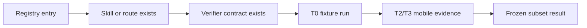

# Harness Task Registry

The Harness Task Registry is the product-facing counterpart of MobileHarnessBench. It turns scattered tools, sheets and routes into typed task metadata so the app can show what a workflow needs, where it runs, which verifier applies and what evidence level it can produce.

## Why A Registry

On-device AI apps are moving beyond chat demos toward task, skill, tool and benchmark surfaces. MobileCode applies that pattern to mobile AI coding: tasks are not just menu buttons. They are typed harness entries with permissions, runtime choices, verifier contracts and evidence labels.

## Registry Entry

```json
{
  "id": "preview.html.basic",
  "title": "HTML Preview",
  "category": "preview_verification",
  "surface": "pushed_route",
  "skill": "html-preview",
  "permissions": ["read_workspace_file", "webview_preview", "preview_metadata"],
  "runtime": ["WebViewOnly", "MobileCodeHelper"],
  "verifier": "preview_html_basic",
  "evidence_tier": "T0_or_T2",
  "counts_as_experiment": false,
  "open_requirements": ["bitmap_screenshot_for_screenshot_grade_claims"]
}
```

Required fields:

| Field | Meaning |
| --- | --- |
| `id` | Stable dotted id. |
| `title` | User-facing name. |
| `category` | One of the MobileHarnessBench categories. |
| `surface` | `drawer`, `home_tab`, `bottom_sheet`, `pushed_route`, `background_task` or `external_bridge`. |
| `skill` | Optional MobileCode Skill package id. |
| `permissions` | Permission tokens required before execution. |
| `runtime` | Allowed runtime routes. |
| `verifier` | Verifier contract id. |
| `evidence_tier` | T0-T5 evidence level. |
| `counts_as_experiment` | Whether this entry can be counted in a paper table. |
| `open_requirements` | Missing evidence or implementation gates. |

## Current Product Mapping

| Task id | Existing surface | Registry category | Verifier boundary | State |
| --- | --- | --- | --- | --- |
| `intake.file.open_with` | External file preview and workspace files | `file_intake` | `file_intake_detected` | partial |
| `edit.artifact.html` | Chat artifact actions and Editor route | `code_edit` | `artifact_file_written` | partial |
| `preview.html.basic` | WebView preview / browser open | `preview_verification` | `preview_html_basic` | partial |
| `preview.markdown.basic` | Markdown preview target | `preview_verification` | `preview_markdown_basic` | planned |
| `delivery.github.pages` | GitHub Repo Hub / Pages publish | `github_delivery` | `github_delivery_basic` | partial |
| `evidence.report.export` | ActionEvidence and report cards | `harness_evidence` | `harness_evidence_complete` | partial |
| `runtime.helper.health` | Runtime providers sheet | `runtime_orchestration` | `runtime_health_basic` | partial |
| `benchmark.lab.inspect` | Benchmark Lab route | `harness_evidence` | `benchmark_lab_readiness` | prototype |

## Navigation Contract

Registry `surface` values map to the current navigation policy:

- `drawer`: global shell entry, not a back action.
- `home_tab`: primary app area, no back arrow.
- `bottom_sheet`: temporary task panel, close button required.
- `pushed_route`: full page route, app bar back arrow required.
- `background_task`: visible through evidence/task center.
- `external_bridge`: requires explicit permission and typed evidence.

## Benchmark Lab Promotion Path



Only the final stages can produce counted benchmark results. Earlier stages are useful product progress, but remain readiness or prototype evidence.
