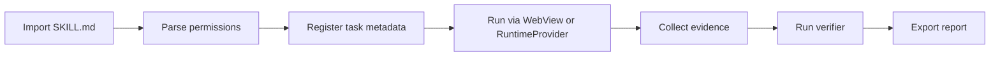

# MobileCode Skill Spec

MobileCode Skill is a small, reviewable package format for phone-native AI coding workflows. It is inspired by the broader movement from chat-only on-device AI demos toward task, skill, tool and benchmark surfaces, but it is scoped to MobileCode's harness boundary: file intake, artifact editing, preview, verifier evidence, runtime routing and public-safe reporting.

## Package Shape

```text
skill-id/
├─ SKILL.md
├─ scripts/
│  └─ index.html
├─ assets/
│  └─ optional-preview-or-fixture-files
└─ verifier.json
```

## `SKILL.md`

`SKILL.md` is the human-readable contract. It should be short enough to inspect on a phone.

Required fields:

| Field | Meaning |
| --- | --- |
| `name` | Stable display name. |
| `description` | What the skill does and what it must not claim. |
| `inputs` | Accepted file types, prompt shapes or task metadata. |
| `outputs` | Expected artifact paths, preview URLs, reports or evidence ids. |
| `permissions` | File, WebView, network, GitHub, runtime and clipboard requirements. |
| `verifier` | Machine-readable verifier id or verifier bundle path. |
| `fallback` | Safe behavior when runtime, network, WebView or permission is unavailable. |

Minimal example:

```markdown
---
name: html-preview
description: Preview a generated HTML artifact and report mobile readability evidence.
permissions:
  - read_workspace_file
  - webview_preview
  - preview_metadata
verifier: preview_html_basic
---

Open `index.html`, check that it is a complete HTML document, create a WebView preview, and emit preview metadata. Do not claim bitmap evidence unless a screenshot artifact exists.
```

## `scripts/index.html`

`scripts/index.html` is the executable or previewable skill surface. It can be:

- a hidden WebView worker for JS-only transformations;
- a visible preview UI for HTML/Markdown artifacts;
- a fixture page used by a verifier;
- a bridge page that posts structured results back to the app.

It must not assume raw shell access. Any runtime action must go through `RuntimeProvider` or a declared external bridge.

## Permission Model

Skills use explicit permission tokens instead of ambient authority:

| Permission | Allowed Surface |
| --- | --- |
| `read_workspace_file` | Read app-owned project files selected by the user or task. |
| `write_workspace_file` | Write only under the current MobileCode workspace. |
| `webview_preview` | Open an artifact in a WebView. |
| `preview_metadata` | Capture DOM/title/viewport metadata. |
| `preview_bitmap` | Capture a screenshot artifact when the platform supports it. |
| `github_sandbox` | Use an authorized public or sandbox repo flow. |
| `runtime_typed_task` | Start a structured RuntimeProvider task. |
| `network_fetch` | Fetch a declared URL through a typed tool. |
| `clipboard_write` | Copy an artifact path, URL or report text after user action. |

Permission prompts should be evidence-generating events. A denied permission is a typed result, not a crash.

## Verifier Contract

Each skill declares a verifier that converts "the model says done" into machine-checkable evidence.

```json
{
  "id": "preview_html_basic",
  "inputs": ["artifact_path", "preview_metadata"],
  "required_evidence": ["file_exists", "complete_html_document", "webview_opened"],
  "optional_evidence": ["bitmap_screenshot"],
  "failure_kinds": ["missing_file", "invalid_html", "webview_failed", "metadata_only"]
}
```

Verifier results must include:

- `status`: `passed`, `failed`, `blocked` or `open_requirement`;
- `counts_as_experiment`: boolean;
- `evidence_paths`: artifacts, reports or logs;
- `failure_kind`: typed reason when not passed;
- `recovery_hint`: next safe action.

## Skill Lifecycle



## Initial Skill Set

| Skill | Purpose | Verifier |
| --- | --- | --- |
| `html-preview` | Preview and validate single-file HTML artifacts. | `preview_html_basic` |
| `markdown-preview` | Render Markdown, check heading density and image references. | `preview_markdown_basic` |
| `github-publish` | Commit or publish artifacts through authorized GitHub surfaces. | `github_delivery_basic` |
| `artifact-report` | Produce public-safe Markdown/JSON evidence reports. | `harness_evidence_complete` |
| `runtime-health` | Check Helper/Termux/WebViewOnly route status. | `runtime_health_basic` |

## Public Claim Boundary

This spec is a design contract. A skill counts as implemented only after the app can register it, execute its declared surface, collect evidence, and run its verifier under the appropriate mobile evidence tier.
