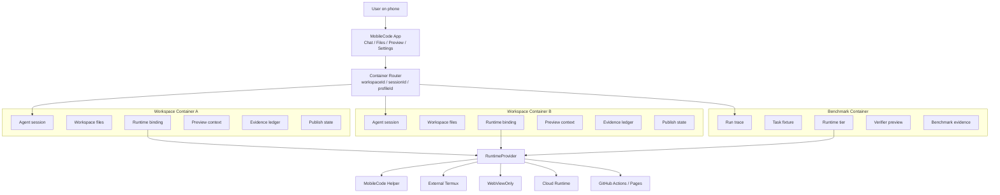
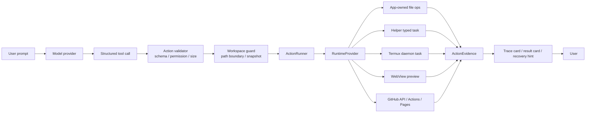
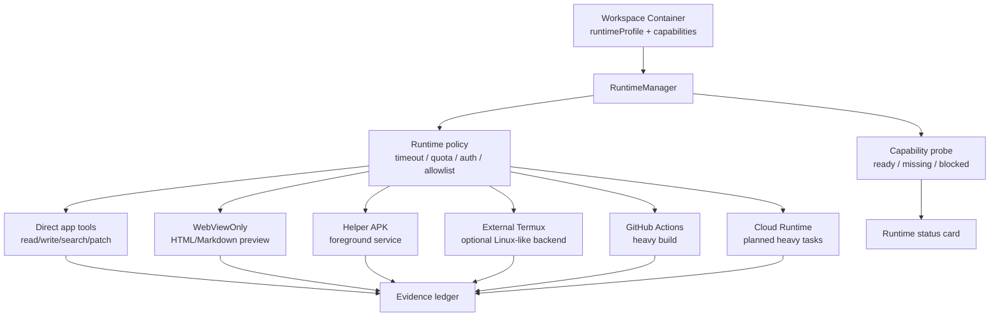
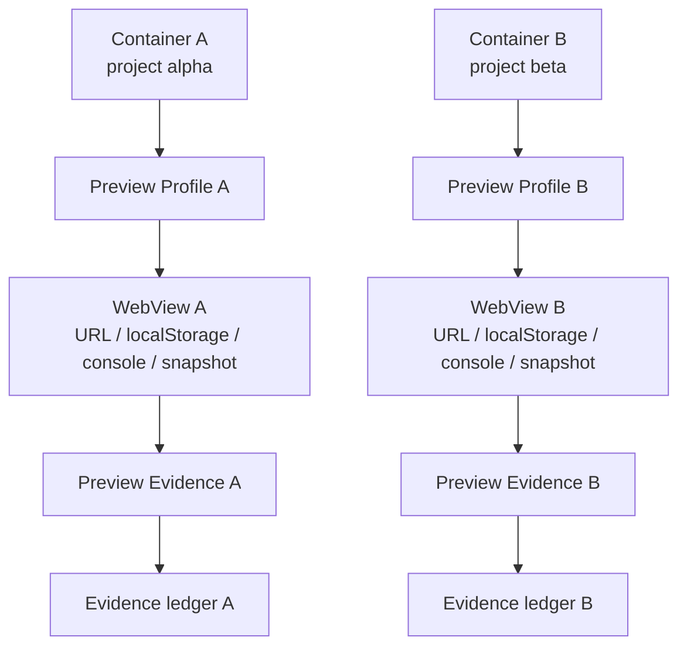
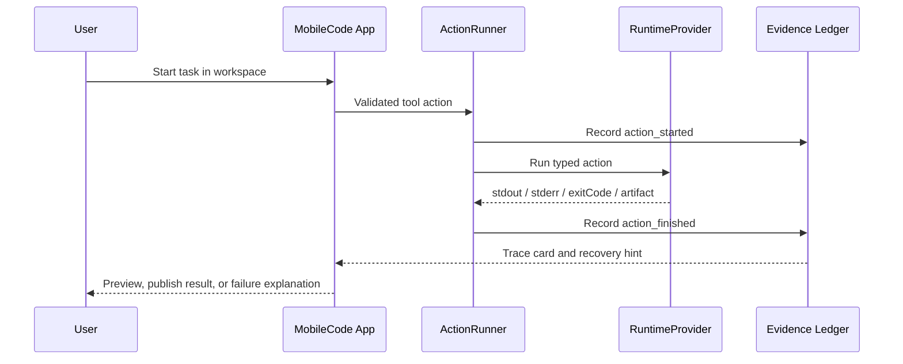

# MobileCode 安全容器架构说明

MobileCode 要做成多工作区、多运行时、多预览、多证据账本的安全容器系统，目的不是做应用双开、APK Hook、改包名或虚拟机。它的目标是把一次手机端 AI coding 任务变成一个边界清晰、可恢复、可预览、可审计、可交付的工作容器。

一句话：MobileCode 的容器不是拿来克隆 App 的，而是拿来隔离“开发现场”的。

## 为什么要这样做

手机不是桌面 Linux 环境。Android 和 iOS 都有强沙盒，普通 App 不能随便读写全盘、运行任意 shell、长期托管后台进程或启动完整构建工具链。如果 MobileCode 假装自己是桌面 IDE，会很快遇到权限、稳定性、安全和用户信任问题。

AI coding 又天然需要试错：模型会写文件、读文件、修复错误、预览页面、触发构建、发布结果。如果这些动作都混在一个全局目录、一个全局 WebView、一个全局运行时和一堆散乱日志里，用户很难知道：

- 哪个项目被改了。
- 哪个运行时执行了命令。
- 哪个预览对应哪个文件。
- 哪一步失败了。
- 失败后能不能恢复。
- 结果能不能作为论文、评测或发布证据。

所以 MobileCode 需要把每个任务组织成一个安全容器：

```text
WorkspaceContainer =
  workspace files
  + agent session
  + runtime binding
  + preview context
  + evidence ledger
  + publish state
```

这样做的核心目的有五个：

1. 隔离项目，避免 AI 把 A 项目的文件写进 B 项目。
2. 隔离运行时，避免 Helper、Termux、WebViewOnly、Cloud 的能力边界变成隐藏状态。
3. 隔离预览，避免 WebView 的 URL、缓存、localStorage、console log 和截图证据互相污染。
4. 保留证据，让每次工具调用、失败原因、恢复动作、发布结果都能回放。
5. 支撑论文和 benchmark，让 MobileHarnessBench 的任务、轨迹、验证器和结果有可复现边界。

## 对用户有什么用

对普通用户，它意味着：

- 可以同时维护多个手机端项目，不怕互相覆盖。
- 每个项目都有自己的聊天、文件、预览、发布状态。
- 运行失败时能看到是缺 Termux、Helper 未启动、GitHub 权限失败，还是 HTML 本身有问题。
- 可以从失败现场继续，而不是重新问一遍模型。
- 生成的页面、报告、APK 构建、GitHub Pages 发布都有结果卡和证据。

对开发者和研究者，它意味着：

- 可以比较不同 runtime profile 的成功率和失败类型。
- 可以把 prompt -> tool call -> tool result -> preview -> verifier -> report 串成完整轨迹。
- 可以把 MobileCode 从“聊天 App”提升为可评测的 phone-native AI coding harness。
- 可以为论文准备真实 mobile evidence，而不是只展示 demo。

## 总体架构图



这个图表达的是：MobileCode 不是一个全局聊天窗口，而是多个容器的控制台。每个容器都可以选择不同的运行时、预览方式和发布目标。

## 执行链路图



这里最关键的是：模型不能直接拿到裸 shell。它只能发结构化工具调用，MobileCode 先验证 schema、路径、权限、大小、超时，再交给合适的 runtime。

## 多运行时架构图



这样做的用途是把“在哪儿执行”变成显式状态。用户不需要猜当前任务是在 App 内、Termux、Helper、WebView 还是 GitHub Actions 里跑。

## 多预览隔离图



这个设计可以避免两个 HTML demo、两个账号型页面、两个测试任务共享同一套预览状态。即使底层仍是系统 WebView，也要在 MobileCode 的应用层记录 profile 和 evidence 归属。

## 证据账本图



证据账本的价值不是“多写日志”，而是让 MobileCode 可以回答三个问题：

- 发生了什么。
- 为什么失败或成功。
- 现在用户可以怎么继续。

## 和手机双开沙盒的关系

手机双开启发 MobileCode 的是“多实例隔离”的思想，不是它的灰色实现技术。

MobileCode 不应该做：

- APK 改包名重打包。
- Hook AMS、PackageManager、IO 路径。
- Dex 动态加载第三方 App。
- 绕过 iOS BundleID 或企业证书限制。

MobileCode 应该做：

- App 内多 workspace。
- App 内多 agent session。
- RuntimeProvider 后面的多 backend。
- WebView preview profile。
- ActionEvidence 和 verifier evidence。
- GitHub Pages、Actions、Artifacts 的交付闭环。

也就是说，MobileCode 的“容器”是产品和架构层的安全容器，不是绕系统限制的应用多开容器。

## 最小落地路线

第一阶段：

- 给每个项目生成稳定的 `workspaceId`。
- 把 agent session、workspace path、preview path、evidence records 绑定到同一个 `workspaceId`。
- 所有工具调用都写入 `ActionEvidence`，并带上 `workspaceId`。

第二阶段：

- 增加 `runtimeProfile`，记录 Helper、Termux、WebViewOnly、GitHub Actions 的能力状态。
- `termux_task_start` 等 runtime task 必须带 workspace boundary 和 evidence id。
- UI 上显示当前容器的运行时状态。

第三阶段：

- 增加 preview registry，区分 HTML、Markdown、Flutter web、terminal output。
- 每个 preview 带 `previewId`、`workspaceId`、source file、URL、console summary 和 snapshot metadata。

第四阶段：

- 让 MobileHarnessBench 的 run manifest 直接引用 workspace container、runtime profile、preview evidence 和 verifier result。
- 形成可复现的 paper evidence pack。

## 判断标准

这个架构成立的判断标准很简单：

- 用户能清楚知道当前在哪个项目里工作。
- 模型不能越界读写文件。
- 每个执行动作都有明确 runtime。
- 每个预览都能追溯到源文件。
- 每次失败都有 typed failure kind 和恢复建议。
- 每个可发布结果都有证据链。

做到这些，MobileCode 就不是一个手机聊天壳，而是一个真正的 phone-native AI coding harness。
