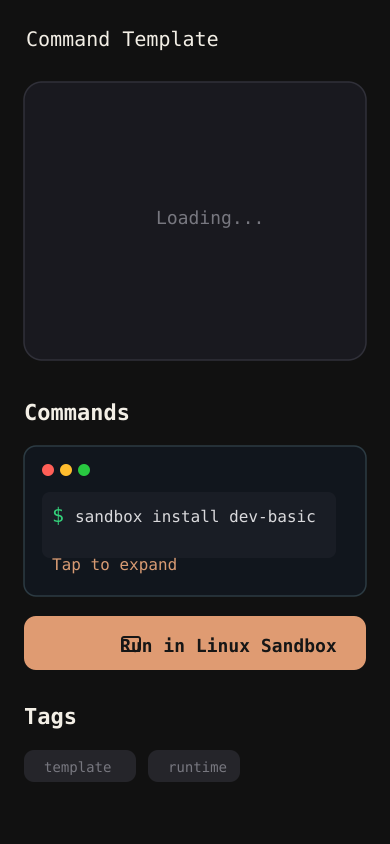
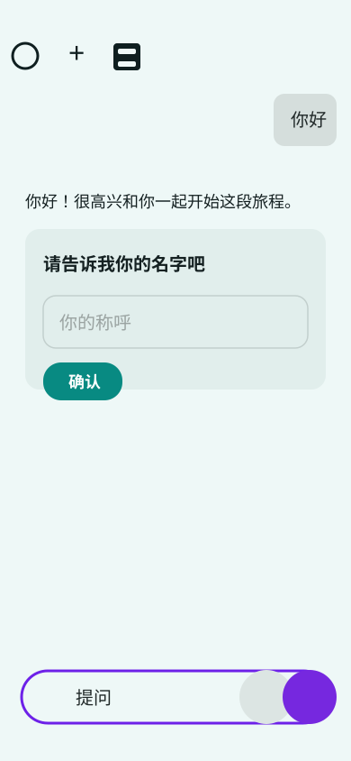
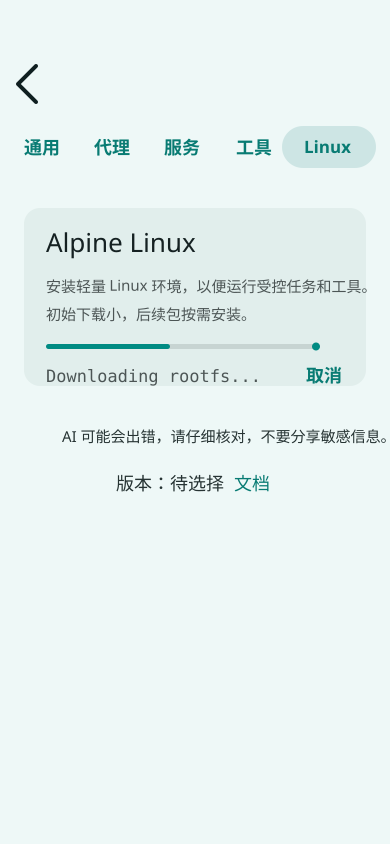

# MobileCode Linux Sandbox 长期 Roadmp

> 目标：把 MobileCode 的本地执行层升级为内置、可审计、可恢复的轻量 Linux Sandbox。Android 内置 Helper / LinuxSandboxProvider 是主线；Termux、iSH 和 Cloud 只作为 fallback、研究路线或可替换 RuntimeProvider。

## 使用方式

- 本文件是长期路线图；阶段完成后才在这里打钩。
- 细节任务后续拆到 `roadmap/tasks/` 或独立 `docs/mobilecode-linux-sandbox-*.md`。
- `[x]` 只表示已有证据证明完成；参考图只证明方向已捕获，不证明实现完成。
- 所有实现都必须经过 RuntimeProvider、ActionEvidence、路径边界、日志与用户可见恢复建议。
- 不把完整 Termux 作为默认内置方向；Termux 是 Android 外部高级 runtime / fallback。
- 不把 iSH 作为 iOS 已承诺主线；iSH 先作为 research spike 和外部 handoff 评估。

## 当前基线

- [x] 已保存长期方向参考笔记：[mobilecode-linux-sandbox-reference.md](mobilecode-linux-sandbox-reference.md)。
  - Evidence: 2026-06-25 文件已存在，记录外部 runtime handoff、Identity Naming、Alpine Linux Sandbox 三个产品参考；本文件已将主线收敛为内置 Linux Sandbox。
- [ ] 当前 Android App 仍没有正式可用的内置 Linux Sandbox。
  - Evidence: 2026-06-26 已接入 provider skeleton、manifest、settings surface、rootfs installer 状态机、typed task boundary、emulator runner proof、Package Profiles 和 Extension Center；物理真机 proof、视觉 QA 和真实用户登录 E2E 仍未完成，因此不能宣称正式发布可用。
- [ ] 当前 iOS 仍没有正式可用的 Linux-like runtime；iSH bridge 只处于研究方向。
  - Evidence: 2026-06-25 已新增 [mobilecode-ios-linux-like-runtime-research.md](mobilecode-ios-linux-like-runtime-research.md)，明确 iSH 只是 external fallback/research。
- [ ] 当前 `ExternalTermuxProvider` 仍属于外部 Termux/未来 bridge 方向，不是主线内置 runtime。

## Reference Assets / 参考图

> 说明：当前会话没有提供可写入文件系统的原始截图文件路径；因此这里保存的是基于用户截图重绘的脱敏参考图。保留交互结构和产品洞察，不复制品牌、状态栏、账号或原始 trade dress。拿到原图文件后，可替换这些 SVG。

| ID | Asset | What To Borrow | Must Not Copy | Notes |
| --- | --- | --- | --- | --- |
| R1 |  | 命令卡片、复制按钮、标签、内置 sandbox 任务启动；外部 runtime 只作为 fallback。 | 原 App 品牌、具体工具名、状态栏、原始视觉风格、把 Termux 当默认依赖。 | Built-in Linux Sandbox task card 模板。 |
| R2 |  | 首次问名字、确认按钮、轻量身份记忆。 | 原 App 对话样式、完整品牌视觉、私人输入记录。 | 用于 MobileCode 称呼系统和 prompt context。 |
| R3 |  | `Linux Sandbox` 设置 tab、Alpine 卡片、rootfs 下载进度、取消、版本/文档入口。 | 原 App 颜色细节、状态栏、具体未验证版本承诺。 | Linux Sandbox 主路线视觉模板。 |

## Key Decisions

- [x] 决策：长期方向是 `MobileCode Linux Sandbox`，不是完整内置 Termux。
  - Evidence: 2026-06-25 本文件和参考笔记记录该决策。
- [x] 决策：Android 主线是内置 Helper / LinuxSandboxProvider；`Open in Termux` 只保留为 fallback，不进入默认链路。
  - Evidence: R1 已调整为内置任务卡片模板，Termux 仅作为 fallback 语义。
- [x] 决策：Identity Naming 进入长期产品基础设施，而不是一次性聊天技巧。
  - Evidence: R2 已记录为设置与 prompt context 模板。
- [x] 决策：Alpine rootfs 采用“先轻量、后扩展”的安装模型。
  - Evidence: R3 已记录为 Linux Sandbox 安装模板。
- [x] 决策：Android runner 首发采用 bundled PRoot native runner，并通过 MethodChannel 暴露 typed tasks。
  - Evidence: 2026-06-26 `LinuxSandboxRunner` 已在 Android 16/API 36 arm64 emulator 上通过 `apk/git/node/npm/lark-cli` proof；Kai reference 用于校准 PRoot 下 `apk` exit code 需以 postcondition verify 为准。
- [ ] 待决策：iOS 是否做 iSH 外部 handoff research；不得在 research 前写入产品完成标准。
- [x] 决策：Agent 默认不允许 raw shell；首发只开放 typed task，用户手动终端模式后续另设 gate。
  - Evidence: 2026-06-26 `LinuxSandboxRuntimeProvider` 和 Android runner 都只接受 allowlist typed tasks；unknown task/raw execute 返回 `commandBlocked`。

## 产品完成标准

- [x] 用户可以在设置中看到 `Linux Sandbox`，下载、暂停/取消、重置 Alpine rootfs。
- [x] 用户可以按需安装包组：Base、Dev Basic、Node Pack、Python Pack。
- [x] RuntimeProvider 能报告 `linuxSandbox` 的 git/node/python/packageManager 能力；raw shell capability 只对用户手动终端可见。
- [x] Agent 通过 typed task 使用 Linux Sandbox，不默认暴露任意 raw shell。
- [x] Android 端有可验证 runner proof：`apk --version`、`git --version`、`node --version`。
- [x] 所有下载包有版本、URL、SHA-256、大小、来源、重试和删除能力。
- [x] 所有执行产生日志、ActionEvidence、失败分类和恢复建议。
- [ ] QA 截图或录屏证明实现接近 R1/R2/R3 的交互流。
- [ ] Security gate 通过：rootfs 存储边界、执行权限、网络策略、包源信任、日志脱敏、删除/恢复全部可验证。

## 推荐执行顺序

1. LinuxSandboxProvider 骨架。
2. Alpine rootfs manifest。
3. Rootfs 下载、校验、解压、删除/恢复。
4. Android runner proof。
5. Package Profiles。
6. Agent typed task 边界。
7. Built-in task card / handoff UI。
8. Identity Naming 与 iOS research 可并行或后置，不阻塞主线。

## 阶段 0：参考资产与路线收敛

- [x] 保存三张参考图的脱敏本地资产。
  - Evidence: 2026-06-25 `docs/assets/reference/linux-sandbox-roadmp/r1-open-in-termux.svg`、`r2-identity-prompt.svg`、`r3-alpine-linux-sandbox.svg` 已创建。
- [x] 写入长期 roadmp。
  - Evidence: 2026-06-25 `docs/mobilecode-linux-sandbox-long-term-roadmp.md` 已创建。
- [ ] 如果用户提供原始图片文件，替换 SVG 为原始或裁剪脱敏 PNG，并保留 SVG 作为公开安全版本。
- [ ] 将本路线同步到主 `roadmp.md` 的长期方向区，避免散落。

## 阶段 1：LinuxSandboxProvider 骨架

目标：把 Linux Sandbox 接入 RuntimeProvider，而不是做成孤立功能页。

- [x] 增加 `RuntimeProviderType.linuxSandbox`。
  - Evidence: 2026-06-25 `mobile_agent/lib/services/runtime_provider.dart` 已加入 `linuxSandbox`。
- [x] 增加 `LinuxSandboxProvider` 占位实现。
  - Evidence: 2026-06-25 `mobile_agent/lib/services/linux_sandbox_provider.dart` 已加入 `LinuxSandboxRuntimeProvider`，实现 `RuntimeProvider`、`RuntimeTypedTaskRunner`、`RuntimeTaskMonitor`。
- [x] 增加 capability 字段：`packageManager`、`rootfsInstalled`、`packageProfiles`。
  - Evidence: 2026-06-25 `RuntimeCapabilities` 已加入字段，`LinuxSandboxRuntimeProvider.capabilities()` 已按 rootfs/profile 状态上报。
- [x] 增加安全 capability 字段：`networkPolicy`、`rawShellAllowed`、`rootfsVerified`、`writableMounts`。
  - Evidence: 2026-06-25 provider 默认 `rawShellAllowed=false`，rootfs 未安装时 `networkPolicy=disabled`，安装态才暴露 `writableMounts=['workspace']`。
- [x] RuntimeManager 选择证据中展示 Linux Sandbox 为什么可用/不可用。
  - Evidence: 2026-06-25 `RuntimeManager.withExternalTermux()` 已把 `LinuxSandboxRuntimeProvider` 放在 Helper 后、Termux fallback 前；health check 返回 rootfs missing 与恢复建议。
- [x] Tool/Settings 统一展示：WebViewOnly、Helper、Linux Sandbox、Termux、Cloud。
  - Evidence: 2026-06-25 设置页新增 `Linux Sandbox` 入口；provider order 保留 Helper、Linux Sandbox、Termux daemon、External Termux、Embedded Lite、Cloud、WebViewOnly。
- [ ] `termux_task_start` 命名后续评估是否改为更中性的 `runtime_task_start`。

Exit Criteria:

- [x] App 能显示 Linux Sandbox provider，但在 rootfs 未安装时明确显示 unavailable 和恢复建议。
  - Evidence: 2026-06-25 `flutter test test/services/linux_sandbox_provider_test.dart test/services/runtime_manager_test.dart test/widgets/linux_sandbox_screen_test.dart` 通过，覆盖 unavailable/recovery UI 与 manager provider order。
- [x] Agent 只能看到 typed capability，不会因为 provider 存在而获得 raw shell。
  - Evidence: 2026-06-25 provider `execute()` 对 raw shell 返回 `commandBlocked`，`runTypedTask()` 只接受 `project_check`、`package_install`、`git_version`、`node_version`、`npm_build`。

## 阶段 2：Alpine Rootfs Manifest + 安装器

目标：先定义可信 manifest，再复刻 R3 的优雅路径：一键下载最小 rootfs，用户按需扩展。

- [x] 设计 rootfs manifest：id、版本、架构、URL、SHA-256、压缩大小、解压大小、license、来源。
  - Evidence: 2026-06-25 `LinuxSandboxRootfsManifest` 已定义；内置 Alpine 3.24.1 aarch64/x86_64 manifest 来自 Alpine official `latest-releases.yaml`，包含 URL、SHA-256、大小、license、source、publishedAt。
- [x] 设置页新增 `Linux Sandbox` tab。
  - Evidence: 2026-06-25 `mobile_agent/lib/screens/linux_sandbox_screen.dart` 已加入 rootfs/package/security surface，`SettingsScreen` 可进入；widget test 覆盖。
- [x] 实现下载状态：idle、downloading、verifying、extracting、installed、failed、cancelled。
  - Evidence: 2026-06-25 `LinuxSandboxInstallStatus` 已定义完整状态枚举；`LinuxSandboxRuntimeProvider.installRootfs()` 已串起 download、sha256 verify、tar.gz extract、installed/failed/cancelled 状态。
- [x] 支持取消、重试、删除、重置。
  - Evidence: 2026-06-25 provider 新增 `cancelRootfsInstall()`、`deleteRootfs()`、`resetRootfs()`；Linux Sandbox screen 暴露下载、取消、删除/重置按钮；focused widget/service tests 通过。
- [ ] 支持 app-owned storage 下的安装目录和 quota 提示。
- [ ] 支持基础健康检查：rootfs 存在、manifest 匹配、checksum 通过。

Security Gate:

- [x] rootfs 只能安装到 app-owned storage，不读取用户授权范围外路径。
  - Evidence: 2026-06-25 rootfs 安装目录由 `getApplicationSupportDirectory()/linux-sandbox/rootfs` 或测试注入 app-owned base 生成；tar entry path 经过 absolute/`..`/escape validation。
- [x] rootfs manifest 必须有 URL、SHA-256、大小、license、来源和发布时间。
  - Evidence: 2026-06-25 `LinuxSandboxRootfsManifest` 测试校验官方 URL、SHA-256 长度、大小和 JSON roundtrip；发布时间写入 `publishedAt`。
- [x] 下载、校验、解压、删除必须有可恢复状态；失败不能留下半安装为可用状态。
  - Evidence: 2026-06-25 checksum mismatch test 证明失败停在 `failed` 且 `rootfsVerified=false`；install/delete tests 证明成功安装和删除状态可恢复，ActionEvidence 记录 install/delete 结果。
- [ ] 默认网络策略为最小可用；包源和镜像源必须可见、可重置、可禁用。
- [ ] 执行日志必须过滤 token、cookie、env、local secret paths 和 credential-like 字符串。
- [ ] rootfs 删除/重置必须清理包缓存、临时文件和任务残留。

Visual Acceptance:

- [ ] 设置页卡片接近 R3：Alpine Linux 标题、说明、进度条、状态文案、取消、版本、文档入口。
- [ ] 明确显示“初始 rootfs 小；开发包按需安装”，不承诺默认全家桶。

## 阶段 3：Android Runner Proof

目标：证明 Android 可以在 MobileCode 控制下运行轻量 Linux 用户态任务。

- [x] 调研并选择 runner：PROot、bundled native runner、受控 shell wrapper 或其他方案。
  - Evidence: 2026-06-26 Android 选择 bundled PRoot native runner，通过 `MethodChannel` 暴露 `LinuxSandboxRunner` typed tasks；Kai 参考仓库用于校准 PRoot 下 `apk add` exit code 不能单独作为成功判据。
- [x] 证明 `apk --version` 可运行。
  - Evidence: 2026-06-26 `connectedDebugAndroidTest` 在 Android 16/API 36 arm64 emulator 上通过，`apk_version` 输出 `apk-tools 3.0.6-r0, compiled for aarch64.`。
- [x] 证明 `apk add git` 或等价安装流程可完成。
  - Evidence: 2026-06-26 `package_install devBasic` 安装 `git`、`curl`、`ca-certificates` 后执行 postcondition verify，输出 `git version 2.54.0` 和 `curl 8.20.0`。
- [x] 证明 `git --version` 可运行。
  - Evidence: 2026-06-26 `git_version` typed task 输出 `git version 2.54.0`。
- [x] 证明 `apk add nodejs npm` 或等价安装流程可完成。
  - Evidence: 2026-06-26 `package_install nodePack` 安装 `nodejs`、`npm` 后执行 postcondition verify，输出 `v24.17.0` 和 `11.12.1`。
- [x] 证明 `node --version` 和 `npm --version` 可运行。
  - Evidence: 2026-06-26 `node_version` 输出 `v24.17.0`，`npm_version` 输出 `11.12.1`。
- [x] 所有命令必须经过 workspace/path validation。
  - Evidence: 2026-06-26 runner 只接受 `apk_version`、`git_version`、`node_version`、`npm_version`、`project_check`、`package_install`、`npm_build` typed tasks；`npm_build` cwd 必须位于 `/root` 且拒绝 `..`。
- [x] 记录 Android 版本、ABI、targetSdk、设备型号、耗时、失败原因。
  - Evidence: 2026-06-26 instrumentation log 记录 `device model=sdk_gphone64_arm64`、`android release=16 sdk=36`、`abis=arm64-v8a`，每个 typed task 记录 `durationMs`、`exitCode`、`failureKind`、stdout/stderr 摘要。

Exit Criteria:

- [ ] 一台物理 Android 设备完成 `apk/git/node/npm` proof。
  - Evidence: 2026-06-26 emulator proof 已通过；物理真机 proof 需要安装 debug APK 后补充设备型号、Android 版本、ABI、截图或日志。
- [x] 失败时 UI 显示 typed failure kind 和恢复建议。
  - Evidence: 2026-06-26 provider 将 native runner 失败映射为 `failureKind`、stdout/stderr、metadata 并记录 ActionEvidence；rootfs 未安装和未知 typed task 已有 focused tests 覆盖恢复文案。

## 阶段 4：Package Profiles

目标：把环境扩展变成用户可理解的包组。

- [x] Base：busybox、shell、apk。
- [x] Dev Basic：git、curl、ca-certificates。
- [x] Python Pack：python3、pip。
- [x] Node Pack：nodejs、npm。
- [x] Lark CLI profile：nodejs、npm、curl、ca-certificates、官方 `@larksuite/cli`。
  - Evidence: 2026-06-26 CLI Hub manifest 和 `LinuxSandboxPackageProfiles.larkCli` 已将 `@larksuite/cli` 纳入包组；Android native runner `package_install larkCli` 先验证 node/npm，再执行 `npm install -g --no-audit --no-fund @larksuite/cli`，并用 `lark-cli --version` 做 postcondition verify。emulator proof 输出 `lark-cli version 1.0.58`；真实登录后的真机 E2E 仍未完成。
- [x] 每个包组展示预估下载、安装后体积、能力变化。
- [x] 每个包组支持 installed/needsUpdate/failed 状态。
- [x] 包组安装产生日志和 ActionEvidence。
  - Evidence: 2026-06-26 `package_install` 通过 native runner 返回 stdout/stderr、exitCode、durationMs、profileId、packages、verifyCommand、postconditionVerified；`LinuxSandboxRuntimeProvider.runTypedTask()` 会把 native typed task 结果写入 ActionEvidence。

## 阶段 5：Agent 使用边界

目标：AI 能用 Linux Sandbox，但不能失控。

- [x] 默认只暴露 typed tasks：apk_version、project_check、package_install、git_version、node_version、npm_version、lark_cli_probe、lark_cli_auth_start、lark_cli_auth_status、lark_cli_execute、npm_build。
  - Evidence: 2026-06-26 `LinuxSandboxRuntimeProvider.runTypedTask()` 和 Android `LinuxSandboxRunner.runTypedTask()` 只接受内置 typed task；Lark CLI 登录启动必须用户确认，执行命令只接受 `auth_status`、`wiki_space_list` 内置 commandId，不暴露 raw shell。
- [x] raw shell 只允许用户手动终端模式，不默认给模型。
  - Evidence: 2026-06-25 provider capability 始终 `rawShellAllowed=false`，raw `execute()` 和未知 typed task 都失败关闭。
- [x] 模型不能直接请求任意包安装；必须使用 package profile 或用户批准的 typed task。
  - Evidence: 2026-06-25 `package_install` typed task 只接受内置 profile id，未知 profile 返回 `commandBlocked`，未批准 profile 返回 `approvalRequired`；focused test 覆盖。
- [ ] 每个任务记录 cwd、args、profile、timeout、stdout/stderr 摘要。
- [x] 敏感信息过滤：token、cookie、env、local secret paths。
  - Evidence: 2026-06-26 Android runner 对 stdout/stderr 执行基础 redaction；Dart `LinuxSandboxRuntimeProvider` 在 native result 返回 UI 和写入 ActionEvidence 前再次过滤 token/cookie/secret/password/Bearer 和 `/Users`、`/Volumes` 本机路径；focused test 覆盖未脱敏 native stdout/stderr/metadata。
- [ ] 网络访问、包安装、文件写入和长任务必须有单独 approval/evidence。
- [ ] 长任务必须有停止按钮、后台通知和恢复历史。
- [ ] 失败必须能回到 WebViewOnly、Helper 或 Cloud。

## 阶段 6：Built-in Sandbox Task Handoff

目标：在 Provider、rootfs、runner proof 和 Agent 边界存在后，让 Android 用户从 MobileCode 命令卡片启动内置 Linux Sandbox typed task；外部 runtime 只作为 fallback。

- [x] 在命令卡片、runtime task 卡片中增加 `Run in Linux Sandbox` / `复制命令`。
  - Evidence: 2026-06-25 新增 `LinuxSandboxTaskCard`，Linux Sandbox screen 已嵌入 runtime task preview，widget test 覆盖 `Run in Linux Sandbox` 和 copy action。
- [x] 默认行为：创建 typed task preview，展示 cwd、args、timeout、capability、预计影响。
  - Evidence: 2026-06-25 `LinuxSandboxTaskPreview` 展示 cwd、args、timeout、capability、impact。
- [x] 用户确认后由内置 Helper / LinuxSandboxProvider 执行 typed task。
  - Evidence: 2026-06-25 `LinuxSandboxScreen._runProjectCheck()` 调用 `LinuxSandboxRuntimeProvider.runTypedTask(taskKind: 'project_check')`；runner proof 未接通时返回明确 blocker。
- [x] Fallback：Linux Sandbox 未安装时引导安装；内置执行不可用时可选择复制命令或外部 runtime handoff。
  - Evidence: 2026-06-25 task card 在 rootfs 未安装时主按钮变为 `Install rootfs`，复制按钮始终可用；外部 Termux 仍未作为默认路径出现。
- [x] 扩展中心提供 Git、Node、Lark CLI 的一键安装入口和 probe 入口。
  - Evidence: 2026-06-26 `ExtensionCenterScreen` 改为加载 CLI Hub catalog，内置 Alpine Runtime、Git、Node.js/npm、Lark CLI 可从同一页面安装/检测；安装成功后会刷新 native package status 并把卡片更新为已安装；widget test 覆盖 Lark CLI 一键安装后的状态刷新。
- [x] 扩展中心提供 Lark CLI 官方登录启动、登录状态和只读执行入口。
  - Evidence: 2026-06-26 CLI Hub `tasks` 声明 `lark_cli_auth_start`、`lark_cli_auth_status`、`lark_cli_execute`；扩展中心安装 Lark CLI 后显示“登录 / 状态 / 执行”按钮；widget test 覆盖 `lark_cli_auth_status` 触发。`lark_cli_execute` 当前仅允许 `wiki_space_list` 只读命令，写入命令不开放。
- [ ] 外部 Termux handoff 只作为高级 fallback，并仅在用户明确选择后出现。
- [ ] 记录 task evidence：点击动作、provider、结果、fallback 原因。

Visual Acceptance:

- [ ] 实现截图/录屏证明命令卡片具备 R1 的核心结构：命令预览、复制、展开、Run in Linux Sandbox。
- [ ] 不复制 R1 原 App 品牌或原始视觉皮肤。

## 阶段 7：Identity Naming / 称呼系统

目标：让 MobileCode 记住用户称呼和用户对 MobileCode 的昵称。该阶段是产品体验基础设施，不阻塞 Linux Sandbox 主线。

- [x] 设置页新增 `Identity / 称呼`。
  - Evidence: 2026-06-25 `SettingsScreen` 新增 `Identity / 称呼` 入口，进入 `IdentityNamingScreen`。
- [x] 支持用户称呼：例如 `你的称呼`。
- [x] 支持 MobileCode 昵称：例如 `MobileCode`、`自定义昵称`。
- [x] 支持 assistant self-name/persona label。
- [x] 将称呼偏好持久化到本地安全配置。
  - Evidence: 2026-06-25 `IdentityNamingService` 使用 SharedPreferences 本地持久化三个字段；service/widget tests 通过。
- [ ] 将紧凑 identity block 注入模型上下文。
  - Evidence: 2026-06-25 `IdentityNamingPreferences.compactContextBlock()` 和 `IdentityNamingService.compactContextBlock()` 已实现本地 context block 生成；尚未接入 AgentLoop 自动注入。
- [ ] AgentLoop 中识别用户对 MobileCode 的昵称，不误认为任务实体。

Visual Acceptance:

- [ ] 首次设置或设置页编辑流接近 R2：问名字、输入、确认、后续对话自然使用称呼。
  - Evidence: 2026-06-25 设置页编辑流已支持用户称呼、MobileCode 昵称和 assistant self-name，widget test 覆盖保存；首次设置和后续对话自然使用尚未接入。
- [x] 不把称呼设置写入公开日志、截图发布素材或远端 telemetry。
  - Evidence: 2026-06-25 IdentityNamingService 仅写 SharedPreferences；compact block 标记 `localOnly; doNotPublishToLogsOrTelemetry`，未新增远端发送路径。

## 阶段 8：iOS Linux-like Runtime Research

目标：研究 iOS Linux-like 路线，不在验证前承诺 iSH bridge 或内嵌 engine 为产品能力。

- [x] 调研 iSH 可用 URL scheme、文件导入、快捷指令、剪贴板和外部启动能力。
  - Evidence: 2026-06-25 已新增 [mobilecode-ios-linux-like-runtime-research.md](mobilecode-ios-linux-like-runtime-research.md)，列出 URL scheme/Shortcuts/file import/export/clipboard/external launch 作为进入 iOS adapter 前的 QA gate；未宣称已验证通过。
- [x] 调研 App Store、license、性能、维护成本和用户授权边界。
  - Evidence: 2026-06-25 research note 记录 iSH official site、GitHub repository、App Store listing，并明确 iSH 是独立 app/fallback，不计入内置 Linux Sandbox 完成标准。
- [ ] 验证 iSH 上 `apk`、`git`、`node` 的可行性和性能边界。
- [ ] 仅在 research 通过后，再决定是否设计 `IshRuntimeProvider` 或 `LinuxSandboxProvider` iOS adapter。
- [x] 如果只做外部 handoff，必须标记为 fallback，不计入 Linux Sandbox 产品完成标准。
  - Evidence: 2026-06-25 research note 和本 roadmp 均写明 iSH external handoff 不能算 MobileCode Linux Sandbox 完成。

## 阶段 9：发布与 QA

- [x] 增加 Linux Sandbox smoke test 文档。
  - Evidence: 2026-06-26 新增 `mobile_agent/tooling/linux_sandbox_android_proof.sh`，脚本会运行 `LinuxSandboxRunnerInstrumentedTest` 并保存 `adb-devices.txt`、device props、APK sha256、Gradle 输出、logcat 和 proof lines。
- [x] 增加 Android 真机 QA 清单：下载、校验、安装包、运行版本命令、删除。
  - Evidence: 2026-06-26 `linux_sandbox_android_proof.sh` 默认拒绝 emulator-only proof；物理机插入后运行 `mobile_agent/tooling/linux_sandbox_android_proof.sh --serial <device-serial>`，通过后才能补充物理机型号、Android 版本、ABI 和 proof logs。
- [ ] 增加 iOS Linux-like runtime research QA 清单。
- [ ] 增加视觉 QA：实现截图对照 R1/R2/R3。
- [ ] 增加 release note 模板：声明 Linux Sandbox 是 opt-in、本地执行可能失败、用户需核对输出。
- [ ] 发布前执行 secret scan，确保 rootfs URL、checksum、日志无 token/cookie。
  - Evidence: 2026-06-25 已对 Linux Sandbox roadmp、reference assets、provider、screen 和 tests 执行 secret scan；只命中安全要求文案中的 token/cookie/secret 字样，未命中实际凭据。

## 2026-06-25 Implementation Evidence

- [x] Focused Linux Sandbox tests passed.
  - Evidence: `flutter test test/services/linux_sandbox_provider_test.dart test/services/runtime_manager_test.dart test/widgets/linux_sandbox_screen_test.dart` 通过。
- [x] Affected evidence/runtime tests passed.
  - Evidence: `flutter test test/core/evidence/action_evidence_model_test.dart test/core/evidence/action_runner_test.dart test/services/linux_sandbox_provider_test.dart test/services/runtime_manager_test.dart test/widgets/linux_sandbox_screen_test.dart` 通过。
- [x] Full Flutter tests passed.
  - Evidence: `flutter test` 通过，393 tests passed。
- [x] Local Android debug build passed on Mac.
  - Evidence: `flutter build apk --debug --target lib/main.dart` 成功生成 `build/app/outputs/flutter-apk/app-debug.apk`。
- [x] Patch whitespace check passed.
  - Evidence: `git diff --check` 通过。
- [ ] Full repository analyze is not clean.
  - Evidence: 2026-06-26 `flutter analyze --no-fatal-infos --no-fatal-warnings` 仍报告 5160 个既有 analyzer issues，主要是旧核心动画、ActionRunner、home screen 和测试风格问题；Linux Sandbox/CLI Hub focused tests 已通过，debug APK 主入口可构建。

## 2026-06-26 Android Runner Evidence

- [x] Kai reference repo reviewed for PRoot package behavior.
  - Evidence: `reference-repos/termux/Kai-main` 已解压；`SandboxPackagesViewModel` 说明 PRoot 下 `apk` exit code 可能被数据库错误污染，应在安装后重新验证包状态。
- [x] Native PRoot runner compile and focused Flutter test passed.
  - Evidence: `./gradlew :app:compileDebugKotlin :app:compileDebugAndroidTestJavaWithJavac` 通过；`flutter test test/services/linux_sandbox_provider_test.dart` 通过。
- [x] Android emulator runner proof passed.
  - Evidence: `./gradlew :app:connectedDebugAndroidTest -Pandroid.testInstrumentationRunnerArguments.class=com.mobilecode.app.LinuxSandboxRunnerInstrumentedTest --rerun-tasks` 通过，1 test passed on `Codex_Pixel_7_API_36(AVD) - 16`。
- [x] Proof outputs captured.
  - Evidence: instrumentation log captured `apk-tools 3.0.6-r0`、`git version 2.54.0`、`node v24.17.0`、`npm 11.12.1`、`lark-cli version 1.0.58`; package profiles Base、Dev Basic、Python Pack、Node Pack、Lark CLI succeeded with postcondition verification.
- [x] Package install is idempotent and timeout evidence is typed.
  - Evidence: 2026-06-26 runner now runs profile postcondition verify before reinstalling an already available package profile; task timeout returns `failureKind=timeout` rather than being masked by stream reader interruption.
- [x] Reusable Android proof script passed on emulator repro lane.
  - Evidence: `mobile_agent/tooling/linux_sandbox_android_proof.sh` refuses emulator by default; `mobile_agent/tooling/linux_sandbox_android_proof.sh --allow-emulator` passed and wrote evidence to `mobile_agent/build/linux-sandbox-proof/20260626-005754/`.
- [ ] Physical Android device QA pending.
  - Evidence: APK can be installed from `build/app/outputs/flutter-apk/app-debug.apk`; current `adb devices -l` only shows `emulator-5554`, so physical device screenshots/logs are still needed before marking physical-device proof complete.

## 2026-06-26 CLI Hub / Extension Center Evidence

- [x] CLI Hub catalog scaffold added.
  - Evidence: 新增 `cli-hub/README.md`、`cli-hub/schema/cli-hub.schema.json`、`cli-hub/catalog/mobilecode-cli-hub.manifest.json`，收录 Git、Node.js/npm、Lark CLI、GitHub CLI、Firebase CLI、Vercel CLI、Netlify CLI、Cloudflare Wrangler、AWS CLI、Google Cloud CLI、Azure CLI；catalog 只声明官方来源、安装策略、probe、auth 边界和安全说明，不携带凭据。
- [x] App consumes the catalog through a typed service.
  - Evidence: 新增 `CliHubCatalogService`，校验 duplicate id 和 package profile id；`ExtensionCenterScreen` 使用 catalog 生成扩展卡片，而不是硬编码 Git/Node/Lark 三项。
- [x] Lark CLI official install/login/status/readonly execution surface is wired without claiming completed user login.
  - Evidence: `lark_cli_probe` 检测 node/npm/lark-cli，emulator proof 已输出 `lark-cli version 1.0.58`；`lark_cli_auth_start` 执行官方 `lark-cli auth login --recommend --no-wait` 登录启动；`lark_cli_auth_status` 执行官方状态检查；`lark_cli_execute` 只允许 `wiki_space_list` 内置只读命令。catalog 将 Lark CLI 标为 `preview`、`auth.required=true`、`storage=secureStorage`，仍需真机完成用户登录后的 E2E QA。
- [x] Focused tests and local APK build passed.
  - Evidence: 2026-06-26 `flutter test test/services/cli_hub_catalog_service_test.dart test/services/linux_sandbox_provider_test.dart test/widgets/extension_center_screen_test.dart test/widgets/linux_sandbox_screen_test.dart` 通过，16 tests passed；`flutter build apk --debug --target lib/main.dart` 通过并生成 `mobile_agent/build/app/outputs/flutter-apk/app-debug.apk`，大小 86M，sha256 `f4625a23e940c12348b8fa7a1eaa120583af810996904bf3b5fa096638f2697b`。

## 风险与边界

- [ ] Android runner 方案可能受 targetSdk、设备厂商、SELinux、ABI 影响，需要真实设备矩阵。
- [ ] Alpine 包安装后体积会增长；这是包组选择问题，不是方向 blocker。
- [ ] iSH 只是 iOS Linux-like research 候选；性能、兼容性、授权和分发边界未验证前不能进入产品完成标准。
- [ ] 不承诺 Flutter/Android 本地重构建首发可用；重构建仍优先 Cloud/CI。
- [ ] 不承诺任意 Linux 命令都能运行；首发只证明 Git/Node/Python 等开发基础包。

## Open Questions

- [x] Android runner 首选实现是什么。
  - Answer: 2026-06-26 首发采用 bundled PRoot native runner + MethodChannel typed task；物理设备矩阵仍是发布 gate。
- [ ] Alpine rootfs 来源、版本和 checksum 由谁维护。
- [ ] 是否将 `termux_task_start` 改名为 `runtime_task_start`。
- [ ] iOS 是否做 Linux-like runtime research；若只做 iSH 外部 handoff，是否放入 fallback 文档而非产品主线。
- [ ] Linux Sandbox 是否需要单独的终端屏，还是只作为 Agent runtime。

## Assumptions

- [ ] 用户接受“先下载小 rootfs，再按需安装包”的模型。
- [ ] 用户接受 Linux Sandbox 是 opt-in runtime，不是默认强制依赖。
- [ ] MobileCode 继续坚持 typed tasks 和 evidence，不回到无限制 shell。
